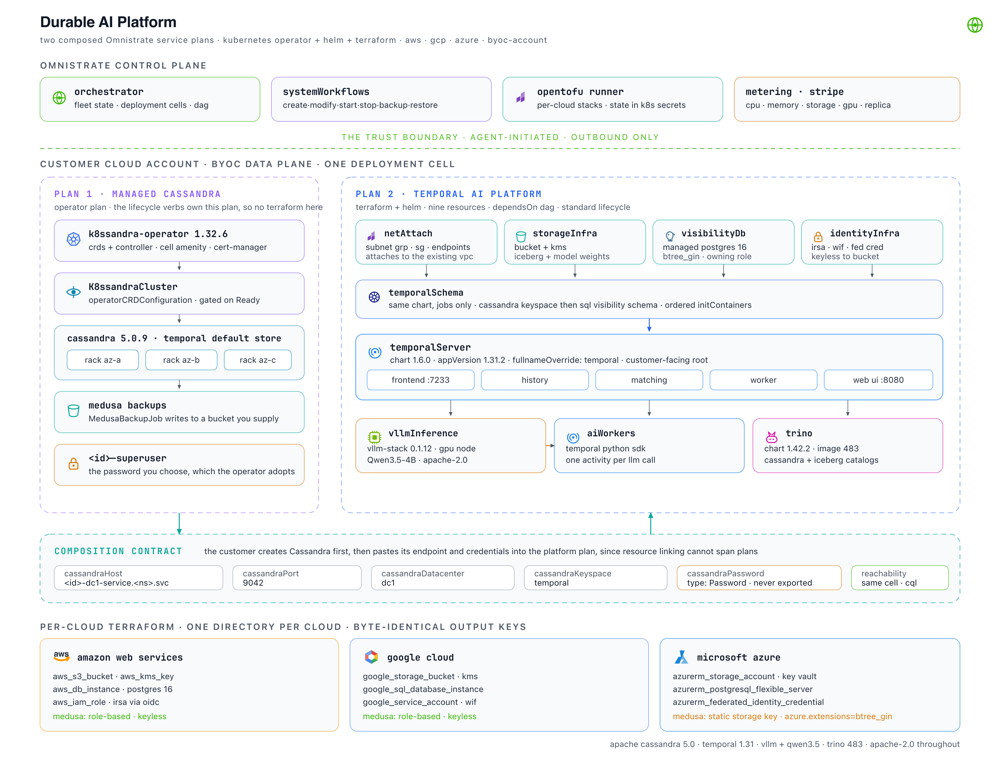

# Durable AI Platform

A reference implementation built on [Omnistrate](https://omnistrate.com), showing how a Kubernetes
operator, four Terraform stacks and five Helm releases become two managed SaaS offerings that compose,
running in the customer's own AWS, GCP or Azure account.

> Durable AI workflows that survive anything. Every model call is a replayable Temporal activity,
> every result is queryable SQL, and the whole platform runs in the customer's cloud.



The two plans are [`plans/plan1-managed-cassandra.yaml`](plans/plan1-managed-cassandra.yaml) and
[`plans/plan2-temporal-ai-platform.yaml`](plans/plan2-temporal-ai-platform.yaml).
[docs/architecture.md](docs/architecture.md) covers what each layer contributes, what differs per
cloud, and what to arrange before the first deployment.

## The workload

An AI agent that calls a model fifty times over twenty minutes is a distributed systems problem before
it is a prompt engineering problem. Temporal records each inference as a durable activity that survives
a pod restart mid-run, Cassandra absorbs the resulting write volume, and Trino makes the output
queryable.

The sample workload is document triage. A batch of documents is classified one model call at a time,
each call being its own Temporal activity with its own retry policy. Results land per-document in
Cassandra and as an Iceberg aggregate in object storage, so losing a worker halfway through a batch
costs nothing: the documents already classified are not re-inferred and the batch finishes on another
pod.

Temporal writes a row per workflow state transition rather than per workflow, so a thousand concurrent
agents at fifty steps each is roughly fifty thousand append-only writes with no joins. That is the
workload Cassandra is built for.

## Two offerings

**Managed Cassandra** is a multi-rack Apache Cassandra cluster with a full lifecycle: create, scale,
stop, start, back up, restore, repair, recover a failed node. A customer can subscribe to it on its own.

**Temporal AI Platform** is a durable AI workflow engine, built on a Managed Cassandra instance, with
Temporal, vLLM on a GPU node, Trino, a managed PostgreSQL and an object store.

```
PLAN 1  Managed Cassandra                 PLAN 2  Temporal AI Platform
──────────────────────────                ────────────────────────────
cassandraCluster  [operator CR]           netAttach       [terraform]  ┐
  ├ systemWorkflows: create, modify,      storageInfra    [terraform]  │ internal
  │   start, stop, delete, backup,        visibilityDb    [terraform]  │
  │   restore, deleteBackup, failover     identityInfra   [terraform]  ┘
  ├ customWorkflows: repair               temporalSchema  [helm, internal]
  ├ capabilities.backupConfiguration      temporalServer  [helm]  ← customer-facing
  └ Medusa backups to a nominated bucket  vllmInference   [helm, GPU]
                                          aiWorkers       [helm]
enableDeletionProtection: true            trino           [helm]

        outputs ─── contact point, port, datacenter, keyspace ───► inputs
```

Temporal keeps its workflow history and shards in Cassandra, and its searchable visibility index in a
managed PostgreSQL instance provisioned alongside. The same PostgreSQL server carries the database
behind Trino's Iceberg catalog.

## Using them together

A customer creates the Cassandra instance, then supplies four values when creating the platform
instance:

| Parameter | Value |
| --- | --- |
| `cassandraHost` | `<instance-id>-dc1-service.<namespace>.svc.cluster.local` |
| `cassandraPort` | `9042` |
| `cassandraDatacenter` | `dc1` |
| `cassandraPassword` | the password chosen when the Cassandra instance was created |

The first three appear on the instance detail page. The password stays with the customer, who sets it
on the Cassandra instance and supplies the same value here.

Instances in the same deployment cell share a cluster and a cell-wide DNS zone, so the platform reaches
Cassandra over in-cluster CQL. Creating both against the same VPC with
`cloud_provider_native_network_id` makes that independent of cell placement.

## Repo layout

```
plans/
  plan1-managed-cassandra.yaml      operator plan, nine lifecycle verbs plus repair
  plan2-temporal-ai-platform.yaml   nine resources, Terraform and Helm
terraform/{aws,gcp,azure}/
  netattach/                        attaches to the cell's existing network
  storage/                          bucket and CMK
  visibilitydb/                     managed PostgreSQL 17, two databases
  identity/                         IRSA, GKE Workload Identity, Azure federated credential
images/ai-worker/                   the Temporal worker image and its Helm chart
seed/seed-demo.sh                   loads sample workflow history into a running instance
docs/
  architecture.md                   what each layer does and how the clouds differ
  walkthrough.md                    guided tour of a running deployment
  architecture.svg, .png, .html     the diagram
```

The fourteen core Terraform output keys are spelled identically across all three clouds, so the base
Helm values reference `{{ $storageInfra.out.bucket_uri }}` once for every provider. The differences
that survive that are carried in `layeredChartValues` layers gated on
`$sys.deploymentCell.cloudProviderName`: the workload-identity annotation key, Trino's filesystem
switch and Iceberg catalog, and Azure's second `abfss://` form of the same container.

The `.tf` files themselves hold no `$sys`, `$var` or `.out.` expressions, so each module runs under
plain `tofu apply` outside the platform. Each cloud's values arrive as a `.tfvars` string in
`variablesValuesFileOverride` on that cloud's `terraformConfigurations` entry.

## Deploying

### Sentinels

```bash
grep -rn 'REPLACE_ME_' plans/ images/ terraform/
```

| Sentinel | What it is |
| --- | --- |
| `REPLACE_ME_AWS_ACCOUNT_ID` | the AWS account that hosts the control plane. `byoaDeployment` places it in AWS whichever cloud the instances themselves run in. |
| `REPLACE_ME_AWS_BOOTSTRAP_ROLE_ARN` | bootstrap role ARN in that account |
| `REPLACE_ME_GIT_REPO_URL` | this repository, reachable by the Terraform runner |
| `REPLACE_ME_GIT_TAG` | a pinned tag such as `refs/tags/v0.1.0` rather than a branch |
| `REPLACE_ME_REGISTRY` | registry holding the `ai-worker` image |
| `REPLACE_ME_STRIPE_PRODUCT_ID` | Stripe product id, one per plan |

### Deployment cell prerequisites

cert-manager and then the k8ssandra operator install as cell amenities, in that order, on every cell
that can host a Cassandra instance. Both are cluster-scoped, so they belong to the cell rather than to
an instance.

GPU quota also needs arranging in advance, since all three clouds ship new accounts with a quota of
zero and the increase goes through support rather than a console setting.

### Build and release

Both builds run from the repo root. The platform plan ships the `ai-worker` chart as a
[local chart artifact](https://docs.omnistrate.com/getting-started/build-from-helm/#using-a-local-helm-chart-artifact-with-ctl),
so `omctl` resolves `images/ai-worker/chart` relative to the working directory, packages it, uploads
it, and reads the metadata from `Chart.yaml`.

```bash
omctl login
cd /path/to/omnistrate-platform-demo

omctl build --spec-type ServicePlanSpec \
  --file plans/plan1-managed-cassandra.yaml \
  --product-name "Durable AI Platform" \
  --environment Dev --environment-type dev --release-as-preferred

# Same product name, so both plans appear under one Customer Portal
omctl build --spec-type ServicePlanSpec \
  --file plans/plan2-temporal-ai-platform.yaml \
  --product-name "Durable AI Platform" \
  --environment Dev --environment-type dev --release-as-preferred
```

Pre-packaging the chart yourself also works, with the `.tgz` path in place of the directory:

```bash
helm package images/ai-worker/chart --destination local-artifacts
# then: artifactRelativePath: local-artifacts/ai-worker-0.1.0.tgz
```

### Create instances

```bash
# Cassandra first
omctl instance create \
  --service "Durable AI Platform" --environment Dev --plan "Managed Cassandra" \
  --resource cassandraCluster \
  --cloud-provider aws --region us-east-1 \
  --customer-account-id <account-config-id> \
  --param-file cassandra.json --wait

# Read the contact point off the instance
omctl instance describe <cassandra-instance-id> -o json \
  | jq -r '.consumptionResourceInstanceResult.result_params'

# Then the platform, supplying those values
omctl instance create \
  --service "Durable AI Platform" --environment Dev --plan "Temporal AI Platform" \
  --resource temporalServer \
  --cloud-provider aws --region us-east-1 \
  --customer-account-id <account-config-id> \
  --param-file platform.json --wait
```

The parameter files carry the Cassandra password, so they are gitignored by name. Commit templates as
`cassandra.example.json` instead.

### Load sample data

```bash
omctl deployment-cell update-kubeconfig <cell-id>
./seed/seed-demo.sh --namespace <platform-instance-id> --workflows 200
```

Two hundred workflows at twenty-four documents each runs roughly forty-eight hundred model calls
through vLLM, so it takes a while. The script creates the Cassandra keyspace and the Iceberg table on
first run and can be run again to add more history.

[docs/walkthrough.md](docs/walkthrough.md) picks up from here, with queries to run and a way to watch a
workflow survive losing a worker.

## Checks

```bash
omctl docs validate --file plans/plan1-managed-cassandra.yaml
omctl docs validate --file plans/plan2-temporal-ai-platform.yaml

for d in terraform/*/*/; do (cd "$d" && tofu init -backend=false >/dev/null && tofu validate); done

helm lint images/ai-worker/chart/
helm package images/ai-worker/chart --destination /tmp/pkgtest

# the fourteen shared output keys should each appear three times
grep -h '^output "' terraform/*/*/outputs.tf | sed 's/output "//;s/".*//' | sort | uniq -c
```

Validation on the platform plan reports one violation against the `aiWorkers` resource, which is
expected. That resource ships its Helm chart as a local artifact, so its chart metadata comes from
`images/ai-worker/chart/Chart.yaml` rather than from `chartName` and `chartRepoURL` in the spec.

## Operating notes

A few behaviours are worth knowing before running this in earnest.

The platform instance depends on its Cassandra instance, so deleting the Cassandra one leaves Temporal
without persistence. Deletion protection is enabled on the Cassandra plan to guard against that.

Medusa backups on Azure authenticate with a storage account key, which is the only long-lived
credential in the design. AWS and GCP use federated identity with nothing stored. Azure also needs
`btree_gin` in the `azure.extensions` server parameter before Temporal's visibility schema applies, and
the Terraform module sets it.

The GPU tier takes six to sixteen minutes to come up from zero and around two minutes warm, so leave it
warm before a live session. Metering is hourly and invoices are monthly, which means usage will not
appear within a session; accumulate it overnight and show a draft invoice from a previous period.
`enablePaywall` is the one billing behaviour that responds immediately, blocking instance creation
until a payment method exists.

Every metered workload carries `omnistrate.com/include-customer-billing` on its pod template. The
values path differs per chart, and a workload without the label stays off the bill.
